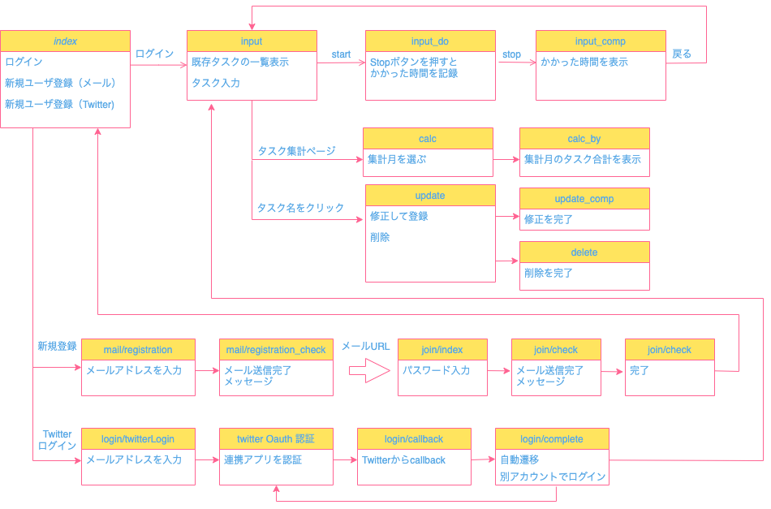

# TaskTimeTracker
タスク名とタスク完了目標時間、実際の終了時間を記録し、集計できるアプリです。
完了目標時間と実際の差を追跡したいタスク全般に使用可能です。例：数学、英語等科目べつに累積学習時間を集計する。

URL:https://tasktimekeeper.herokuapp.com/

# 機能リスト
1. タスク名、完了目標時間の登録
2. 実際にかかった時間の集計
3. 1,2の内容の修正・削除
4. トップページで1の一覧表示
5. ユーザ登録(メールとパスワード・Twitter Oauthログイン)
6. 各タスク名にかかった時間の月次集計

# 利用の流れ
1. トップページでタスク名、完了目標時間の登録
2. タスク完了後、Stopボタンでかかった時間が計算される
3. 当日のタスク一覧がトップページに表示される
4. タスクや集計をCSV出力
5. 続けて利用したければユーザー登録へ

# 制作理由
自分がこのアプリでできる内容を手書きで行なっていて、集計等を自動でできるようにしたいと思ったからです。

#　ユーザフィードバック
・同じタスク名を何度も入力するのが面倒なので一度入力したものを選べるようにして欲しい→（検討中）
・タスク開始後に何分経過したか見られる時計のようなものを表示して欲しい→（検討中）
・タスク開始・終了時刻が日本時間になっているので、別のタイムゾーンにも対応して欲しい→（ClearDBが英国標準時から変えられないが、どのようにすればできるか検討）

# 設計図

# 環境・使用技術
* PHP 7.4.21
* Bootstrap v5.1.2 
* Apache
* MySQL
* Heroku + ClearDB + SendGrid

（予定）Laravelを使用する